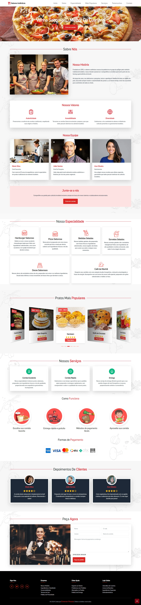

# Criação de uma Page de pizzaria

Bem-vindo ao [Sabores Autênticos Website](https://landingpage-restaurante-three.vercel.app/), uma  page fictícia desenvolvido para fins de atividades e projetos de programação. Qualquer semelhança com sites reais é mera coincidência.

<div align="center" id="topo"></div>

## Sumário

- [Header](#header)
- [Banner Principal](#banner-principal)
- [Seção "Sobre"](#seção-sobre)
- [Seção "Serviços"](#seção-serviços)
- [Seção "Testemunhos"](#seção-testemunhos)
- [Seção "Contato"](#seção-contato)
- [Footer](#footer)
- [Estilização com CSS](#estilização-com-css)
- [Requisitos JavaScript](#requisitos-javascript)
- [Bibliotecas Externas Recomendadas](#bibliotecas-externas-recomendadas)
- [Link de Entrega](#link-de-entrega)
- [Critérios de Avaliação](#critérios-de-avaliação)
- [Visão Geral da Página](#visão-geral-da-página)
- [Sabores Autênticos](#sabores-autênticos)
- [Como Visualizar o projeto localmente](#como-visualizar-o-projeto-localmente)
- [APIs Utilizadas](#apis-utilizadas)
- [Bibliotecas Externas Utilizadas](#bibliotecas-externas-utilizadas)

<a href="#topo">Voltar ao Topo</a>

## Header

- [x] Inclui o logo da empresa e um menu de navegação com links para as seções:

- [x] **Sobre**
- [x] **Serviços**
- [x] **Testemunhos**
- [x] **Contato**
- [x] Contém uma chamada para ação (CTA) como "Entre em Contato" ou "Assine Agora".

<a href="#topo">Voltar ao Topo</a>

## Banner Principal

- [x] Utiliza um slider/carrossel para exibir imagens ou conteúdo sobre os principais serviços/produtos oferecidos pela empresa.
- [x] O slider possui navegação com botões de avançar/retroceder e indicadores (círculos ou barras) para cada slide.
- [x] Implementado com uma biblioteca externa, como [**Swiper.js**](https://swiperjs.com/) ou [**Slick Slider**](https://kenwheeler.github.io/slick/).

<a href="#topo">Voltar ao Topo</a>

## Seção "Sobre"

- [x] Breve introdução da empresa ou produto, com um título e parágrafo descritivo.

<a href="#topo">Voltar ao Topo</a>

## Seção "Serviços"

- [x] Uso de cards ou ícones para descrever os principais serviços ou características do produto.
- [x] Consumo de uma API externa para popular essa seção com dados dinâmicos.

<a href="#topo">Voltar ao Topo</a>

## Seção "Testemunhos"

- [x] Área para exibir depoimentos de clientes satisfeitos, incluindo nome, foto e texto do depoimento.
- [x] Depoimentos podem ser estáticos ou dinâmicos, consumindo uma API de comentários.
- [x] Animações de exibição implementadas com [**AOS.js**](https://michalsnik.github.io/aos/).

<a href="#topo">Voltar ao Topo</a>

## Seção "Contato"

- [x] Formulário de contato com campos para nome, email, telefone e mensagem.
- [x] Validação de formulário usando JavaScript para garantir que todos os campos obrigatórios sejam preenchidos corretamente.
- [x] Integração com [**EmailJS**](https://www.emailjs.com/) para enviar os dados do formulário para um email.

<a href="#topo">Voltar ao Topo</a>

## Footer

- [x] Contém links para as redes sociais da empresa.
- [x] Informações adicionais, como termos de uso e política de privacidade.

<a href="#topo">Voltar ao Topo</a>

## Estilização com CSS

- [x] **Design Responsivo:** A página é adaptada para diferentes dispositivos (desktop, tablet, smartphone) utilizando media queries ou um framework como **Bootstrap** ou **Tailwind CSS**.
- [x] **Slider:** Transições suaves entre as imagens e personalização dos botões de navegação e indicadores.
- [x] **Seção de Testemunhos:** Animações para que os depoimentos apareçam gradualmente à medida que o usuário rola a página.
- [x] **Botões CTA:** Efeito de hover nos botões, com mudanças de cor e tamanho.

<a href="#topo">Voltar ao Topo</a>

## Requisitos JavaScript

- [x] **Consumo de APIs:** Implementação de chamadas a APIs externas para carregar serviços e depoimentos usando `fetch()`.
- [x] **Validação de Formulário:** Validação para garantir que os campos obrigatórios estejam corretamente preenchidos.

- [x] **Slider Interativo:** Uso de bibliotecas externas para criar um carrossel interativo e fluido.
- [x] **Tratamento de Erros:** Mensagens apropriadas para erros na chamada de API.

<a href="#topo">Voltar ao Topo</a>

## Bibliotecas Externas Recomendadas

- [x] [**Swiper.js**](https://swiperjs.com/) ou [**Slick Slider**](https://kenwheeler.github.io/slick/): Para a implementação do slider/carrossel.
- [x] [**AOS.js**](https://michalsnik.github.io/aos/): Para animações ao rolar a página.
- [x] [**Bootstrap**](https://getbootstrap.com/docs/5.3/getting-started/introduction/) ou [**Tailwind CSS**](https://tailwindcss.com/docs/installation): Para design responsivo.
- [x] [**EmailJS**](https://www.emailjs.com/): Para envio de emails diretamente pelo formulário de contato.

<a href="#topo">Voltar ao Topo</a>

## Link de Entrega

- [x] Submeta o link do repositório GitHub.
- [x] Incluir um arquivo `README.md` com instruções de como visualizar o projeto localmente, informações sobre as APIs utilizadas e uma breve explicação das bibliotecas externas aplicadas no projeto.

<a href="#topo">Voltar ao Topo</a>

## Critérios de Avaliação

1. [x] **Funcionalidade:** A página deve estar funcional, com o slider, consumo de API e formulário operando corretamente.
2. [x] **Responsividade:** O design deve se adaptar bem a dispositivos móveis e desktops.
3. [x] **Estilização e Layout:** A página deve ser visualmente atraente, com uma boa disposição dos elementos e uso apropriado de CSS.
4. [x] **Uso de Bibliotecas Externas:** Avaliação do uso adequado de bibliotecas recomendadas e sua implementação correta.
5. [x] **Acessibilidade e Semântica:** Verificar se foram seguidas as boas práticas de acessibilidade e uso de tags semânticas no HTML.

---
<a href="#topo">Voltar ao Topo</a>

## Visão Geral da Página



<a href="#topo">Voltar ao Topo</a>

# Sabores Autênticos

Uma breve descrição do projeto.
> [!IMPORTANT]
> 
> No projeto foi utilizado Bootstrap apenas no Header e Tailwind em todas as seções.<br>
> Metatags Open Graph: foi incluído boas práticas de metatags para otimização de redes sociais, como `og:title`, `og:description`, e `og:image`, o que ajuda a melhorar a forma como a página é compartilhada.

A página exibida é uma landing page de restaurante chamada "Sabores Autênticos", projetada para apresentar informações sobre o estabelecimento e seus serviços de maneira organizada e visualmente atraente.<br>

Estrutura da Página:<br>
- Seção Inicial:<br>
Um banner em destaque com a chamada "Descubra O Sabor Da Nossa Comida" e um botão de chamada para ação.<br>
- Sobre Nós: Apresenta a história do restaurante, valores e equipe, com imagens de alta qualidade e ícones para destacar as informações.<br>
- Nossa Especialidade: Destaque para os pratos especiais, mostrando uma variedade de itens como hambúrgueres, pizzas, sobremesas e bebidas.<br>
- Pratos Mais Populares: Galeria de pratos com preços e botões de ação para fazer um pedido.<br>
- Nossos Serviços: Uma seção que destaca os principais serviços oferecidos pelo restaurante, como qualidade de comida, rapidez no atendimento e opções de entrega.<br>
- Depoimentos de Clientes: Exibe avaliações de clientes satisfeitos, cada uma com uma foto e um breve comentário.<br>
- Peça Agora: Formulário de contato para realizar pedidos, com campos para nome, e-mail e mensagem.<br>
- Rodapé: Inclui links para redes sociais, informações da empresa, links úteis e opções de loja online, finalizando com os direitos autorais.<br>
- A página possui um design moderno e organizado, usando cores e imagens para criar um ambiente convidativo e fácil de navegar.<br>

<a href="#topo">Voltar ao Topo</a>

## Como Visualizar o Projeto Localmente

1. **Clone o repositório:**

   ```bash
    git clone https://github.com/seu-usuario/nome-do-repositorio.git

   ```

2. **Navegue até o diretório do projeto**

   ```bash
    cd nome-do-repositorio

   ```

3. **Instale as dependências do projeto**

   ```bash
   npm install

   ```

4. **Inicie o servidor local**
   ```bash
   npm start
   ```
5. **Acesse o projeto no seu navegador: O projeto estará disponível em: http://localhost:3000.**

<a href="#topo">Voltar ao Topo</a>

## APIs Utilizadas

- **API Local** <code>(data.json)</code>: <br>
  No projeto, foi criado um servidor Express para servir tanto arquivos estáticos na pasta public (HTML, CSS e JavaScript) quanto uma API interna chamada data.json, que fornece dados específicos para a aplicação. Esta API, disponível em: https://landingpage-restaurante-three.vercel.app/api/data, foi deployada na Vercel e configurada utilizando o arquivo de ambiente vercel.json, que define as rotas e endpoints necessários para seu funcionamento.

  A API complementa as seções "Home", "Sobre Nós", "Nossa Especialidade", "Nossos Serviços" e "Depoimentos de Clientes" da Landing Page, injetando os dados diretamente no conteúdo, tornando o site mais dinâmico e fácil de atualizar.

  `EmailJS`: Utilizado para integrar o serviço de envio de e-mails diretamente do front-end, permitindo que formulários enviem dados para uma conta de e-mail sem necessidade de backend.

## Configuração do vercel.json
O arquivo `vercel.json` serve para dizer à Vercel como direcionar as rotas. Segue a estrutura do arquivo:
  ```bash
{
  "version": 2,
  "builds": [
    {
      "src": "server.js",
      "use": "@vercel/node"
    }
  ],
  "routes": [
    {
      "src": "/api/(.*)",
      "dest": "/server.js"
    },
    {
      "src": "/(.*)",
      "dest": "/server.js"
    }
  ]
}

```

## Bibliotecas Externas Utilizadas

- `Bootstrap (v5.3)`: <br>
  Um framework front-end que facilita o desenvolvimento de layouts responsivos com uma coleção de estilos CSS e componentes JavaScript.

```bash
    <!-- Bootstrap CSS -->
    <link
      href="https://cdn.jsdelivr.net/npm/bootstrap@5.3.0-alpha3/dist/css/bootstrap.min.css"
      rel="stylesheet"
      integrity="sha384-KK94CHFLLe+nY2dmCWGMq91rCGa5gtU4mk92HdvYe+M/SXH301p5ILy+dN9+nJOZ"
      crossorigin="anonymous"
    />

    <!-- Bootstrap JS -->
    <script src="https://maxcdn.bootstrapcdn.com/bootstrap/4.5.2/js/bootstrap.min.js"></script>
```

- `Tailwind CSS (Swiper v11)`:<br>
  Biblioteca usada para criar carrosséis e sliders interativos, fornecendo recursos avançados de navegação e animação.

```bash
    <!-- Tailwind CSS -->
    <link href="https://cdn.jsdelivr.net/npm/tailwindcss@2.2.19/dist/tailwind.min.css" rel="stylesheet" />

    <!-- Tailwind JS -->
    <script src="https://cdn.jsdelivr.net/npm/swiper@11/swiper-bundle.min.js"></script>
```

- `AOS (Animate On Scroll)`: <br>
  Uma biblioteca que adiciona animações visuais quando os elementos entram em foco durante o scroll, melhorando a experiência do usuário.

```bash
    <!-- AOS CSS -->
    <link href="https://unpkg.com/aos@2.3.1/dist/aos.css" rel="stylesheet">

    <!-- AOS JS -->
    <script src="https://unpkg.com/aos@next/dist/aos.js"></script>
```

- `EmailJS`: <br>
  Uma biblioteca que permite integrar o serviço de envio de e-mails diretamente do front-end, permitindo que formulários enviem dados para uma conta de e-mail sem necessidade de backend.

```bash
    <!-- EmailJS -->
    <script src="https://cdn.jsdelivr.net/npm/@emailjs/browser@4/dist/email.min.js"></script>
```

- `Swiper`: <br>
  Uma biblioteca avançada para criação de sliders e carrosséis com suporte a navegação por toques, ideal para sites responsivos.

```bash
<!-- Swiper CSS -->
    <link rel="stylesheet" href="https://unpkg.com/swiper/swiper-bundle.min.css" />

<!-- Swipper -->
    <script src="https://unpkg.com/swiper/swiper-bundle.min.js"></script>
```

- `Fonte UniSans`:<br>
  A [fonte UniSans](https://www.freebestfonts.com/uni-sans-font) é uma fonte personalizada incluída no projeto através da regra @font-face. Essa técnica permite que a fonte seja carregada diretamente de arquivos locais, garantindo que ela seja aplicada uniformemente em diferentes dispositivos, independentemente de o usuário ter essa fonte instalada em seu sistema.

```bash
@font-face {
 font-family: "UniSans";
 src: url("../fonts/Uni\ Sans\ Regular.woff") format("woff"),
      url("../fonts/Uni\ Sans\ Light.woff") format("woff"),
      url("../fonts/Uni\ Sans\ Bold.woff") format("woff"),
      url("../fonts/Uni\ Sans\ Bold\ Italic.woff") format("woff"),
      url("../fonts/Uni\ Sans\ Book.woff") format("woff"),
      url("../fonts/Uni\ Sans\ Book\ Italic.woff") format("woff"),
      url("../fonts/Uni\ Sans\ Medium.woff") format("woff"),
      url("../fonts/Uni\ Sans\ Medium\ Italic.woff") format("woff");
}
```
